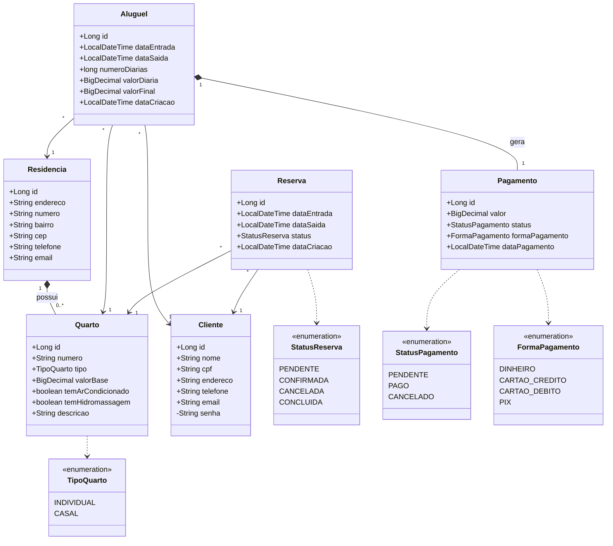

# Sistema de Hospedagem 🏝️

Trabalho Prático da disciplina **Programação Modular** — Bacharelado em Engenharia de Software (PUC Minas).

Sistema de Informação modular com **API REST** para gerenciamento de hospedagens em Maraú-BA: residências, quartos, clientes, reservas, aluguéis, pagamentos e recibos.

---

## ✅ Pré-requisitos

Para rodar o projeto você precisa apenas de:

- **Java JDK 17 ou superior** instalado (confira com `java -version`). Download: [Adoptium / Temurin](https://adoptium.net/).
- **Conexão com a internet** na primeira execução (para baixar o Maven e as dependências do Spring).

> O **Maven NÃO precisa ser instalado** — o projeto já inclui o Maven Wrapper (`mvnw`).
> O **MySQL NÃO é necessário** para avaliar — use o perfil `dev` (banco H2 em memória) descrito abaixo.

## 🚀 Avaliação rápida (2 comandos, sem instalar banco de dados)

Clone o repositório (ou baixe o ZIP em **Code → Download ZIP** no GitHub), entre na pasta do projeto e:

```bash
# 1) Rodar os 41 testes automatizados (usam H2 em memória; não exigem MySQL)
mvnw.cmd test          # Windows
./mvnw test            # Linux / Mac

# 2) Subir a aplicação com dados de exemplo (também sem MySQL)
mvnw.cmd spring-boot:run "-Dspring-boot.run.profiles=dev"     # Windows
./mvnw spring-boot:run -Dspring-boot.run.profiles=dev         # Linux / Mac
```

Depois, abra a documentação interativa e teste os endpoints: **http://localhost:8080/swagger-ui.html**

> Para rodar com **MySQL** (persistência real, como descrito no enunciado), veja a seção [Como executar](#️-como-executar).

---

## 🧱 Tecnologias

| Camada | Tecnologia |
|---|---|
| Linguagem | Java 17 |
| Framework | Spring Boot 3.3 |
| Persistência | Spring Data JPA / Hibernate |
| Banco (produção) | MySQL |
| Banco (testes) | H2 em memória |
| Build | Maven (via Maven Wrapper `mvnw`) |
| Documentação da API | OpenAPI / Swagger UI |
| Segurança de senha | BCrypt |
| Testes | JUnit 5 + Mockito |

---

## 🏗️ Arquitetura em camadas

```
controller  ->  service  ->  repository  ->  model (entidades JPA)
     |             |
    dto         regras de negócio (cálculo de diárias, disponibilidade)
```

- **`model`** — entidades de domínio (`Residencia`, `Quarto`, `Cliente`, `Aluguel`, `Pagamento`, `Reserva`) e enums.
- **`repository`** — interfaces Spring Data (padrão *Repository*).
- **`service`** — regras de negócio. Núcleo: `CalculadoraDiaria`, `DisponibilidadeService`.
- **`controller`** — endpoints REST.
- **`dto`** — objetos de transferência (records) de entrada/saída.
- **`exception`** — exceções de negócio + tratamento global (`GlobalExceptionHandler`).
- **`recibo`** — geração do recibo/formulário de aluguel.

### Padrões de projeto aplicados

| Padrão | Onde |
|---|---|
| **Strategy** | `AdicionalDiaria` e implementações (`AdicionalArCondicionado`, `AdicionalHidromassagem`) — cada item adicional é uma estratégia de cálculo plugável. |
| **Builder** | `Recibo.Builder` — construção do recibo/formulário de aluguel. |
| **Factory** | `QuartoFactory` — criação de quartos por tipo. |
| **Repository** | Interfaces `*Repository` (Spring Data JPA). |
| **DTO** | Pacote `dto` — isola a API das entidades. |
| **Singleton** | Beans gerenciados pelo container Spring (`@Service`, `@Component`, `@Bean`). |

---

## 📊 Diagrama de classes (modelagem orientada a objetos)



> O GitHub renderiza este diagrama automaticamente. Os relacionamentos `*--` indicam composição (o todo controla o ciclo de vida da parte): a residência gerencia seus quartos e o aluguel gera/controla seu pagamento.

---

## 📐 Regras de negócio implementadas

1. **Cálculo de diárias (início às 12h)** — `CalculadoraDiaria.calcularNumeroDiarias`:
   - conta a diferença em dias entre entrada e saída;
   - **saída após as 12h adiciona uma diária**;
   - **entrada após as 12h conta como diária completa** (mínimo de 1 diária).
2. **Valor da diária não é informado diretamente** — é calculado: `valor base do quarto + adicionais` (ar-condicionado e/ou hidromassagem). Os valores dos adicionais são configuráveis em `application.properties`.
3. **Quarto não pode ser alugado se ocupado no período** — `DisponibilidadeService` verifica sobreposição com aluguéis e reservas ativas.
4. **Reservas futuras** — entidade `Reserva` com status (PENDENTE, CONFIRMADA, CANCELADA, CONCLUIDA).
5. **Todo aluguel gera um pagamento associado** — criado junto com o aluguel (status PENDENTE).
6. **Histórico de aluguéis por residência** — `GET /api/alugueis/residencia/{id}`.
7. **Formulário/recibo de aluguel** — `GET /api/alugueis/{id}/recibo`.
8. **Validações adicionais** — não é permitido aluguel ou reserva com data de entrada no passado; reservas já concluídas não podem ser confirmadas nem canceladas; pagamentos só podem ser quitados quando estão pendentes.

---

## ▶️ Como executar

> Não é necessário instalar o Maven — use o wrapper `./mvnw` (Linux/Mac) ou `mvnw.cmd` (Windows).

### ⚡ Opção rápida — rodar SEM instalar o MySQL (perfil `dev`)

Sobe a aplicação inteira usando **H2 em memória**, já com dados de exemplo (1 residência, 2 quartos, 1 cliente):

```bash
# Windows
mvnw.cmd spring-boot:run "-Dspring-boot.run.profiles=dev"

# Linux / Mac
./mvnw spring-boot:run -Dspring-boot.run.profiles=dev
```

- API: `http://localhost:8080` · Swagger: `http://localhost:8080/swagger-ui.html`
- Console do banco: `http://localhost:8080/h2-console` (JDBC URL `jdbc:h2:mem:hospedagem`, usuário `sa`, sem senha)
- Use o arquivo [`requests.http`](requests.http) para disparar requisições de exemplo (VS Code REST Client ou IntelliJ HTTP Client).

> Em H2 os dados são recriados a cada inicialização. Para persistência real (exigida na entrega), use o **MySQL** abaixo.

### 1. Banco de dados (MySQL)

Tenha um MySQL rodando em `localhost:3306`. O schema `hospedagem` é criado automaticamente. Ajuste usuário/senha em [`application.properties`](src/main/resources/application.properties) ou via variáveis de ambiente:

```bash
# Windows (PowerShell)
$env:DB_USERNAME="root"; $env:DB_PASSWORD="suasenha"
```

#### Subir o MySQL rapidamente com Docker (opcional)

Se você usa Docker, pode subir um MySQL já configurado (usuário `root`, senha `root`, banco `hospedagem`) com um comando:

```bash
docker run --name hospedagem-mysql -e MYSQL_ROOT_PASSWORD=root -e MYSQL_DATABASE=hospedagem -p 3306:3306 -v hospedagem-mysql-data:/var/lib/mysql -d mysql:8
```

Para parar e retomar depois (os dados ficam salvos no volume `hospedagem-mysql-data`):

```bash
docker stop hospedagem-mysql     # pausa o banco
docker start hospedagem-mysql    # retoma com os dados intactos
```

### 2. Rodar a aplicação

```bash
# Windows
mvnw.cmd spring-boot:run

# Linux / Mac
./mvnw spring-boot:run
```

A API sobe em `http://localhost:8080`.
Documentação interativa: **http://localhost:8080/swagger-ui.html**

> Dica: defina `hospedagem.seed.enabled=true` para popular o banco com dados de exemplo na primeira execução.

### 3. Rodar os testes

```bash
mvnw.cmd test      # Windows
./mvnw test        # Linux / Mac
```

Os testes usam **H2 em memória** — não exigem o MySQL. São **41 testes**: unitários dos serviços (com Mockito) e de integração ponta a ponta dos endpoints REST (com MockMvc).

---

## 🌐 Principais endpoints

| Recurso | Método | Rota |
|---|---|---|
| Clientes | POST / GET / PUT / DELETE | `/api/clientes` |
| Autenticação | POST | `/api/auth/login` |
| Residências | POST / GET / PUT / DELETE | `/api/residencias` |
| Quartos | POST / GET / PUT / DELETE | `/api/quartos` |
| Disponibilidade de quarto | GET | `/api/quartos/{id}/disponibilidade?dataEntrada=...&dataSaida=...` |
| Reservas | POST / GET | `/api/reservas` (+ `/{id}/confirmar`, `/{id}/cancelar`) |
| Aluguéis | POST / GET / DELETE | `/api/alugueis` |
| Recibo | GET | `/api/alugueis/{id}/recibo` |
| Histórico por residência | GET | `/api/alugueis/residencia/{id}` |
| Pagamentos | GET | `/api/pagamentos` (+ `/{id}/pagar`, `/{id}/cancelar`) |
| Relatório de faturamento | GET | `/api/relatorios/faturamento/residencia/{id}` |
| Quartos disponíveis no período | GET | `/api/relatorios/quartos-disponiveis?dataEntrada=...&dataSaida=...` |

> **Paginação:** as listagens gerais (`GET /api/clientes`, `/api/residencias`, `/api/quartos`, `/api/alugueis`, `/api/reservas`, `/api/pagamentos`) aceitam `?page=`, `?size=` e `?sort=` — ex.: `GET /api/clientes?page=0&size=10&sort=nome,asc` — e retornam a estrutura paginada do Spring Data (`content`, `totalElements`, `totalPages`, ...).

### Exemplo — realizar um aluguel

```http
POST /api/alugueis
Content-Type: application/json

{
  "quartoId": 1,
  "clienteId": 1,
  "dataEntrada": "2026-07-01T14:00:00",
  "dataSaida": "2026-07-03T11:00:00"
}
```

Datas no formato **ISO-8601** (`yyyy-MM-ddTHH:mm:ss`).

---

## 📂 Estrutura do projeto

```
src/main/java/br/com/pucminas/hospedagem
├── HospedagemApplication.java
├── config/         # PasswordEncoder, OpenAPI, seed de dados
├── controller/     # endpoints REST
├── dto/            # records de request/response
├── exception/      # exceções + handler global
├── model/          # entidades JPA + enums
├── recibo/         # recibo (Builder)
├── repository/     # repositórios Spring Data
└── service/        # regras de negócio
    ├── calculo/    # cálculo de diárias (Strategy)
    └── factory/    # criação de quartos (Factory)
```
